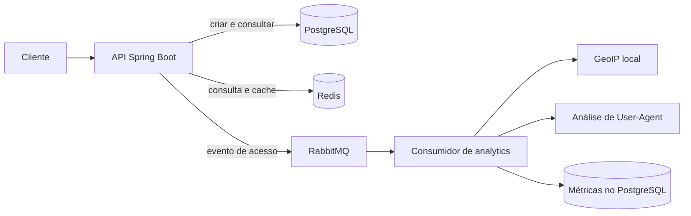

# URL Shortener

Encurtador de URLs desenvolvido com Java e Spring Boot. O projeto demonstra uma API REST com persistência relacional, cache, geração de códigos curtos e coleta assíncrona de dados de acesso.

> **Status:** versão base para portfólio. O fluxo principal está implementado; ainda faltam testes automatizados de comportamento e uma API para consulta dos relatórios de analytics.

## Funcionalidades

- Criação de links curtos para destinos absolutos `http://` e `https://`.
- Redirecionamento HTTP 302 para o endereço original.
- Expiração opcional de links. Links expirados retornam HTTP 410.
- Persistência das URLs no PostgreSQL, com migrações gerenciadas pelo Flyway.
- Cache de leitura com Redis. Links sem data de expiração são armazenados em cache por até 24 horas.
- Publicação assíncrona de eventos de acesso no RabbitMQ.
- Enriquecimento de acessos com país, estado, navegador, sistema operacional e tipo de dispositivo, usando GeoIP local e User-Agent.

## Tecnologias

- Java 25
- Spring Boot 4
- Spring Web MVC, Validation, Data JPA e Spring AMQP
- PostgreSQL e Flyway
- Redis
- RabbitMQ
- MaxMind GeoIP2 e YAUAA (análise de User-Agent)
- Docker Compose para dependências locais

## Como funciona



Na criação, o código é derivado de uma sequência PostgreSQL, transformado e codificado em Base62. No redirecionamento, a aplicação procura primeiro no Redis e consulta o banco quando não encontra o código no cache. Os eventos de acesso seguem para processamento assíncrono; a criação do link é registrada em log.

## Executar localmente

### Pré-requisitos

- JDK 25
- Docker com Docker Compose
- Portas locais disponíveis: `5432` (PostgreSQL), `5672` e `15672` (RabbitMQ), `6379` (Redis) e `8080` (aplicação)

### Configurar ambiente

O Compose e a aplicação leem variáveis de um arquivo `.env` na raiz. Preencha pelo menos estas variáveis:

| Variável | Exemplo local | Uso |
|---|---|---|
| `DB_HOST` | `localhost` | Host do PostgreSQL |
| `DB_PORT` | `5432` | Porta publicada do PostgreSQL |
| `DB_NAME` | `urlshortener` | Banco de dados |
| `DB_USER` | `urlshortener` | Usuário do PostgreSQL |
| `DB_PASSWORD` | `change-me` | Senha local do PostgreSQL |
| `REDIS_HOST` | `localhost` | Host do Redis |
| `REDIS_PORT` | `6379` | Porta publicada do Redis |
| `RABBITMQ_HOST` | `localhost` | Host do RabbitMQ |
| `RABBITMQ_PORT` | `5672` | Porta AMQP |
| `RABBITMQ_USER` | `urlshortener` | Usuário do RabbitMQ |
| `RABBITMQ_PASSWORD` | `change-me` | Senha local do RabbitMQ |
| `DOMAIN` | `http://localhost:8080/` | Base usada para montar o link curto; mantenha a `/` final |

Copie `.env.example` para `.env` e preencha as variáveis com os valores do ambiente local. Não use credenciais de produção no ambiente local nem publique o arquivo `.env`.

### Subir dependências e aplicação

No PowerShell:

```powershell
docker compose up -d
.\mvnw.cmd spring-boot:run
```

No Linux ou macOS:

```bash
docker compose up -d
./mvnw spring-boot:run
```

Na inicialização, o Flyway aplica as migrações SQL existentes. O PostgreSQL, Redis e RabbitMQ devem estar acessíveis com os valores configurados no `.env`.

## API

### Criar uma URL curta

`POST /api/create`

```bash
curl -X POST http://localhost:8080/api/create \
  -H "Content-Type: application/json" \
  -d '{"url":"https://example.com/artigo","expiresAt":"2027-01-01T00:00:00Z"}'
```

`expiresAt` é opcional. Quando informado, deve representar uma data futura. Apenas destinos absolutos HTTP e HTTPS são aceitos.

Resposta ilustrativa (`200 OK`):

```json
{
  "id": "6bfa56f8-b373-47df-aa0a-c32896656644",
  "shortCode": "abc123",
  "originalUrl": "https://example.com/artigo",
  "shortUrl": "http://localhost:8080/abc123",
  "createdAt": "2026-09-30T12:00:00Z",
  "expiresAt": "2027-01-01T00:00:00Z"
}
```

### Redirecionar

`GET /{shortCode}`

Um código válido responde com HTTP 302 e o cabeçalho `Location` apontando para o destino original.

### Erros conhecidos

| Situação | HTTP |
|---|---:|
| Corpo inválido ou destino que não seja HTTP/HTTPS | 400 |
| Código inexistente | 404 |
| Link expirado | 410 |
| Falha interna ao salvar ou gerar o link | 500 |

## Decisões de projeto

- **PostgreSQL como fonte persistente:** mantém URLs e métricas; Redis é uma camada de aceleração, não a fonte oficial dos links.
- **Geração de códigos baseada em sequência:** evita depender de números aleatórios e codifica o resultado em Base62. A transformação não deve ser tratada como mecanismo criptográfico ou garantia de segredo.
- **Expiração consistente:** links expirados retornam HTTP 410, tanto quando encontrados no cache quanto no banco.
- **Analytics assíncrono e best effort:** falhas síncronas ao publicar no RabbitMQ são registradas em log e não impedem o redirecionamento. Como ainda não há outbox transacional nem confirmação durável configurada, eventos podem se perder se o broker falhar.
- **Dados incompletos são mantidos:** campos de localização ou User-Agent sem identificação são gravados como `Desconhecido`; falta de referenciador é representada como `Sem referenciador`, facilitando a leitura agregada.
- **GeoIP empacotado como recurso:** a base local é carregada pelo classpath, evitando depender de um caminho relativo ao diretório de execução.
- **Evento de criação:** a criação da URL é registrada no log; o evento `CREATED` não é enviado para compor métricas de acesso.

## Estado atual e próximos passos

- [ ] Criar testes unitários para validação, criação, expiração e geração de códigos.
- [ ] Criar testes de integração para PostgreSQL, Redis, RabbitMQ e processamento de métricas.
- [ ] Cobrir falhas e dados incompletos nos fluxos de cache e analytics.
- [ ] Normalizar colisões de código causadas por restrições de unicidade para uma resposta HTTP 409.
- [ ] Disponibilizar endpoints para consulta agregada das métricas coletadas.
- [ ] Revisar tags das imagens Docker, persistência dos dados locais e health checks do Compose antes de qualquer implantação.
- [ ] Avaliar outbox transacional e confirmação de publicação caso a perda de eventos não seja aceitável.

O projeto possui infraestrutura de teste com Testcontainers e um teste de inicialização do contexto, mas ainda não tem cobertura automatizada dos fluxos de negócio listados acima. O comando para executar a suíte Maven é `./mvnw test` (Windows: `.\mvnw.cmd test`).
